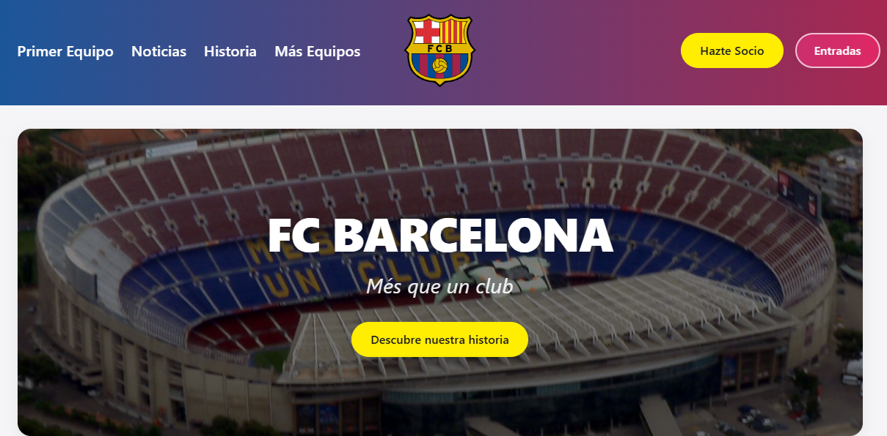

# FC Barcelona Website Clone

[Español](README.md) | [English](README.en.md)



## Descripción

Este proyecto es un clon visual y responsivo del sitio web del FC Barcelona. Fue un proyecto antiguo desarrollado durante el periodo 2024-2025 con HTML, CSS y JavaScript, creado como práctica de maquetación web, organización de contenido y desarrollo de interfaces adaptables.

El sitio recrea una experiencia de navegación inspirada en la web oficial del club e incluye páginas informativas sobre el primer equipo, noticias, historia, estadio, títulos, entradas, socios y otras secciones deportivas.

## Estado del proyecto

El proyecto se conserva como referencia de desarrollo y fue reorganizado para mejorar su estructura interna y facilitar su mantenimiento. Los cambios descritos en este documento forman parte del estado actual de trabajo y todavía no necesariamente están incluidos en un commit.

## Características

- Página de inicio con hero principal y navegación del sitio.
- Cabecera fija con reducción visual al hacer scroll.
- Menú de navegación con submenús desplegables.
- Menú adaptable para dispositivos móviles.
- Sección de jugadores actuales.
- Sección de leyendas del club.
- Información del Spotify Camp Nou.
- Sección de palmarés y títulos.
- Páginas individuales para jugadores.
- Páginas de noticias y próximos partidos.
- Páginas de resultados y clasificación.
- Secciones para el equipo femenino, baloncesto y Barça Atlètic.
- Páginas de historia, estadio, entradas y socios.
- Footer con enlaces internos y externos.
- Diseño responsive para diferentes tamaños de pantalla.

## Tecnologías

- HTML5 para la estructura y el contenido.
- CSS3 para estilos, diseño responsive, animaciones y variables.
- JavaScript para la interacción del menú, el comportamiento del header y el footer.

## Estructura del proyecto

```text
.
├── index.html                # Página principal
├── README.md                 # Documentación del proyecto
├── assets/                   # Imágenes, logos y recursos visuales
│   ├── barca-atletic/        # Recursos del Barça Atlètic
│   ├── basketball/           # Recursos de baloncesto
│   ├── history/              # Recursos históricos
│   ├── news/                 # Recursos de noticias
│   ├── player-pages/         # Imágenes de las páginas individuales
│   ├── players/              # Imágenes de la plantilla
│   ├── stadium/              # Recursos del estadio
│   ├── standings/            # Escudos de clasificación
│   ├── tickets/              # Recursos de entradas
│   ├── upcoming-matches/     # Recursos de próximos partidos
│   ├── women/                # Recursos del equipo femenino
│   └── preview.png           # Vista previa del sitio
├── pages/                    # Páginas secundarias
│   ├── players/              # Páginas individuales de jugadores
│   ├── basketball.html
│   ├── barca-atletic.html
│   ├── history.html
│   ├── latest-news.html
│   ├── membership.html
│   ├── players.html
│   ├── results.html
│   ├── stadium.html
│   ├── standings.html
│   ├── tickets.html
│   ├── trophies.html
│   ├── upcoming-matches.html
│   └── women.html
├── scripts/
│   └── site.js               # Interacciones generales del sitio
└── styles/
    ├── base.css              # Estilos base y componentes compartidos
    ├── home.css              # Estilos de la página principal
    ├── profile.css           # Estilos de perfiles
    └── pages/                # Hojas de estilo de las páginas secundarias
```

## Cambios realizados

### Reorganización de carpetas

- Se renombró `Img/` a `assets/`.
- Se renombró `Paginas/` a `pages/`.
- Se renombró `Css/` a `styles/`.
- Se renombró `Js/` a `scripts/`.
- Se creó una organización interna de assets por áreas funcionales.
- Se separaron los estilos específicos de páginas dentro de `styles/pages/`.
- Se movió `icon.png` a `assets/site-icon.png`.
- Se movió la documentación a la raíz del repositorio.

### Normalización de nombres

- Se tradujeron los nombres de carpetas al inglés.
- Se tradujeron y normalizaron los nombres de las páginas HTML.
- Se adoptó una nomenclatura en minúsculas con guiones, por ejemplo:
  - `Baloncesto.html` pasó a `basketball.html`.
  - `BarcaB.html` pasó a `barca-atletic.html`.
  - `Clasificacion.html` pasó a `standings.html`.
  - `ProximosPartidos.html` pasó a `upcoming-matches.html`.
  - `UltimasNoticias.html` pasó a `latest-news.html`.
  - `Socios.html` pasó a `membership.html`.
  - `Titulos.html` pasó a `trophies.html`.
- Se normalizaron los nombres de las páginas de jugadores, incluyendo `ter-stegen.html` y `szczesny.html`.
- Se renombraron las hojas de estilo para que coincidieran con sus páginas.
- `app.js` pasó a llamarse `site.js`.

### Actualización del código

- Se actualizaron los enlaces internos de todas las páginas HTML.
- Se actualizaron las rutas de imágenes en HTML y CSS.
- Se actualizaron las rutas de hojas de estilo.
- Se actualizó la referencia al script principal.
- Se actualizó la referencia al favicon.
- Se corrigieron las rutas de las páginas individuales de jugadores.
- Se eliminaron las referencias a las carpetas y nombres antiguos.
- Se mantuvo el contenido visual y funcional existente mientras se reorganizaba la estructura.

## Verificación

Después de la reorganización se comprobó que:

- La página principal carga correctamente desde `index.html`.
- Las hojas de estilo principales se cargan desde `styles/`.
- El script general se carga desde `scripts/site.js`.
- Las imágenes de la página principal se muestran correctamente.
- No existen referencias locales rotas en los archivos HTML y CSS.
- No quedan referencias activas a las carpetas antiguas `Img`, `Paginas`, `Css` o `Js`.

## Ejecución

El proyecto no necesita un proceso de compilación. Puede abrirse directamente abriendo `index.html` en un navegador.

Para una experiencia más cercana a un entorno de desarrollo local, también puede servirse con cualquier servidor estático desde la raíz del proyecto.
